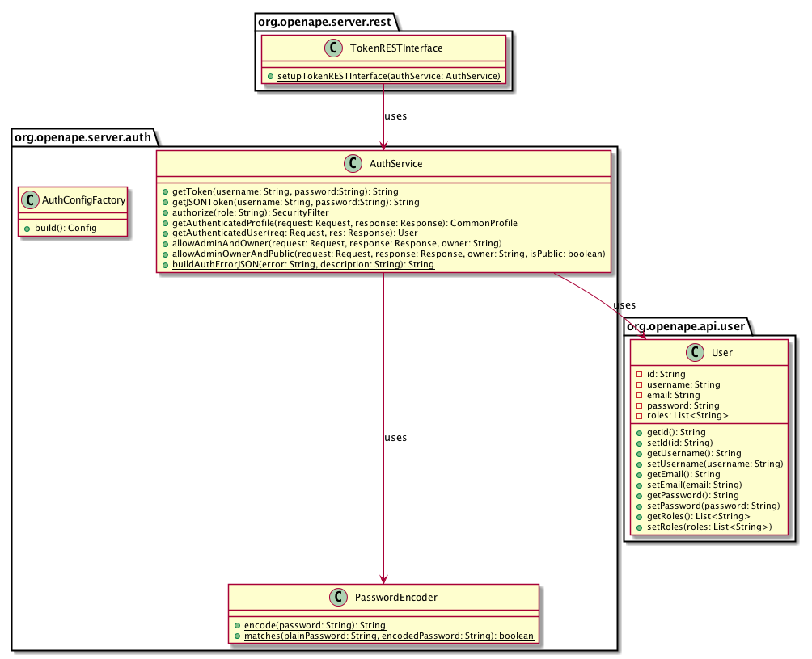

# OpenAPE Authentication

This is the documentation for the OpenAPE authentication and authorization layer.

Document Version: 1.0  
Benjamin Bestmann, April 2017

## Usage

OpenAPE uses a token-based authentication mechanism that is based on the 
[OAuth 2.0 authorization framework](https://tools.ietf.org/html/rfc6749) as specified in the RFC 6749.

Currently the server implements the [resource owner password credentials flow](https://tools.ietf.org/html/rfc6749#section-4.3) 
to grant access tokens to authorized users. This flow includes the following three steps:

1. The resource owner provides the client with its username and password.
2. The client requests an access token from the authorization server's token endpoint by including the credentials received
from the resource owner.
3. The authorization server validates the resource owner credentials, and if valid, issues an access token.

The rest of this section describes this flow in more detail.

### Access Token Request

In order to obtain an access token the client makes a request to the token endpoint by issuing a `POST` request to `/token`. 
In the body of the request he must provide the following data:

* `username`: The username of the resource owner (REQUIRED)
* `password`: The password of the resource owner (REQUIRED)
* `grant_type`: Value MUST be set to "password" (REQUIRED)

For example the client makes the following HTTP request:

    POST /token HTTP/1.1
    Host: server.example.com
    Content-Type: application/x-www-form-urlencoded

    grant_type=password&username=johndoe&password=12345
    
### Access Token Response

If the access token request is valid and authorized, the authorization server issues an access token and returns a JSON
object containing the token together with the status code 200 OK.

    HTTP/1.1 200 OK
    Content-Type: application/json

     {
       "access_token":"eyJhbGciOiJIUzI1NiJ9.eyIkaW50X3Blcm1zIjp",
       "expires_in":1440
     }
     
If the request is invalid, the authorization server returns an response JSON error object explaining the reason and a HTTP
status code of 400 Bad Request.

    HTTP/1.1 400 BAD REQUEST
    Content-Type: application/json#
    
    {
      "error": "invalid_grant",
      "error_description": "Grant type has to be set to `password`"
    }

### JSON Web Tokens

The issued access tokens are [RFC 7519](https://tools.ietf.org/html/rfc7519) compliant JSON Web Tokens (JWT). Any issued 
JWT is an URL-safe, encrypted JSON object, containing all security claims and are digitally signed using HMAC + SHA256
(HS256) and a secret hash signature.

Tokens expire after a default time of 24 hours (1440 minutes). You can configure the token expiration time via the 
`Auth.TokenExpirationTimeInMinutes` property in the `messages.properties` file.

An example token can look like this:
 
    eyJhbGciOiJIUzI1NiJ9.eyIkaW50X3Blcm1zIjpbXSwic3ViIjoib3JnLnBhYzRqLmNvcmUucHJvZmlsZS5Db21tb25Qcm9maWxlIzU4ZjVmMDE1YTk4OWQwN2I2ZGY0ZDM2ZiIsIiRpbnRfcm9sZXMiOlsidXNlciJdLCJleHAiOjE0OTQwNTg3MjEsImlhdCI6MTQ5Mzk3MjMyMSwiZW1haWwiOiJsdWtlQHN0YXJ3YXJzLmNvbSIsInVzZXJuYW1lIjoibHVrZSJ9.qJmEe5sLoyN8lLAwMU7NOEpexB-fqNAfWIPeBBmeGck

Any issued token currently contains the following claims:

* `sub`: The issuer of the token.
* `iat`: The time the token was issued at.
* `exp`: The expiration time of the token.
* `email`: The email of the user the token was issued to.
* `username`: The username of the user the token was issued to.

Tip: For debugging JSON web tokens you can use the debugger tool at: https://jwt.io/.

## Implementation

The auth layer is implemented using the security library [spark-pac4j](https://github.com/pac4j/spark-pac4j) version `2.0.0-RC2`.
For detailed information please also refer to the official [PAC4J documentation](http://www.pac4j.org/docs/index.html).

The OpenAPE implementation basically uses the following components:

* An [HTTP HeaderClient](http://www.pac4j.org/docs/clients/http.html) from the `pac4j-http` package
* A [JWT authenticator](http://www.pac4j.org/docs/authenticators/jwt.html) to validate JSON web tokens using the `pac4j-jwt` package
* Multiple [Authorizers](http://www.pac4j.org/docs/authorizers/profile-authorizers.html#roles--permissions) for checking roles
and authorizing users
 
Additionally the auth layer makes use of Google's [gson](https://github.com/google/gson) library in order to serialize/deserialize
java objects into JSON and back.

### Components

The main components are all part of the `org.openape.server.auth` package. The following section describes the different 
components in more detail.

#### AuthService

The `AuthService` class is the main component that is used to validate credentials, issue tokens, and authorize users roles. 

#### User

The user is a resource owner that can own multiple contexts. Users persisted in the `users` collection in MongoDB. 

A user has the following attributes:

* Id (ObjectID generated by MongoDB)
* Username (unique)
* Email (unique)
* Password
* Roles (List of String)

#### AuthConfigFactory

Factory class to build a PAC4J security configuration from properties and return a Config containing required clients, 
authorizers and matchers.

#### PasswordEncoder

Utility class to encode and decode user passwords in order to securely store them in the database. It uses PBKDF2 with HMACSHA1
in order to hash passwords.

#### Access Token REST Endpoint

Spark REST interface that implements the endpoint for `POST /token` requests in order for clients to get access tokens. 